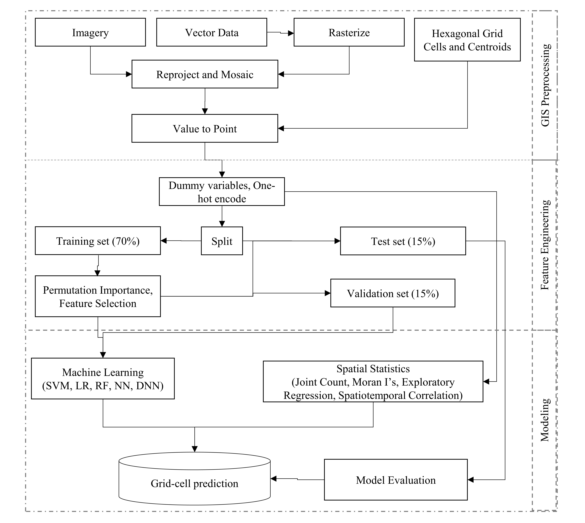

# Predicting Terrorism in Europe with Remote Sensing, Machine Learning, and Spatial Statistics
## A Thesis Presented to the Graduate Faculty of Saint Louis University in Partial Fulfillment of the Requirements for the Degree of Master of Science (M.S.)
© Copyright by
Caleb M. Buffa
ALL RIGHTS RESERVED
2021

=======

[Story Map](https://storymaps.arcgis.com/stories/61c47db0b6434df493c89b16d0cf4eb8)